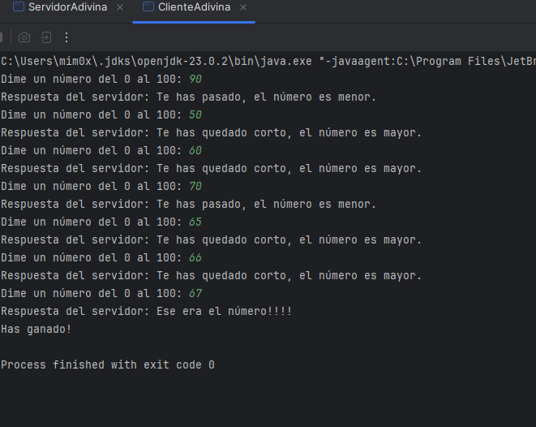
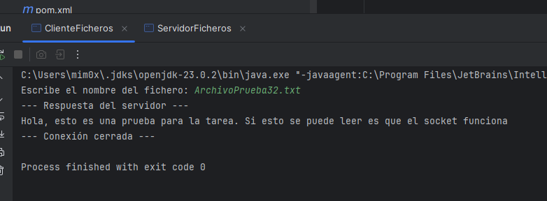
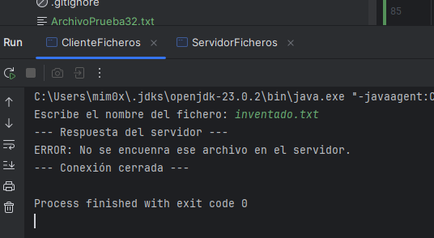

# Memoria de la Tarea PSP03: Programación de Sockets en Java

### [Enlace al repositorio en GitHub](https://github.com/little-shiny/PSP03-Sockets)

## Índice
- [Memoria de la Tarea PSP03: Programación de Sockets en Java](#memoria-de-la-tarea-psp03-programación-de-sockets-en-java)
  - [Enlace al repositorio en GitHub](#enlace-al-repositorio-en-github)
  - [Índice](#índice)
  - [Introducción](#introducción)
  - [Actividad 3.1: Juego de adivinar el número (Puerto 2000)](#actividad-31-juego-de-adivinar-el-número-puerto-2000)
    - [Explicación del Código](#explicación-del-código)
      - [1. `ServidorAdivina.java`](#1-servidoradivinajava)
      - [2. `ClienteAdivina.java`](#2-clienteadivinajava)
  - [Actividad 3.2: Transferencia de Ficheros (Puerto 1500)](#actividad-32-transferencia-de-ficheros-puerto-1500)
    - [Explicación del Código](#explicación-del-código-1)
      - [1. ServidorFicheros.java](#1-servidorficherosjava)
      - [2. ClienteFicheros.java](#2-clienteficherosjava)
  - [Estructura de Paquetes y Organización](#estructura-de-paquetes-y-organización)
  - [Pruebas realizadas](#pruebas-realizadas)
  - [Conclusión](#conclusión)


## Introducción

En esta práctica he desarrollado dos mini aplicaciones basadas en el modelo cliente/servidor utilizando`java.net`. El objetivo es entender cómo se comunican dos programas a través de la red usando TCP, gestionando puertos específicos y flujos de datos.


## Actividad 3.1: Juego de adivinar el número (Puerto 2000)

El servidor genera un número aleatorio y el cliente intenta adivinarlo. La comunicación se mantiene abierta hasta que el cliente acierta.

### Explicación del Código

#### 1. `ServidorAdivina.java`

* Puerto 2000: Es el que he elegido según el enunciado.
* DataInputStream y DataOutputStream: Los he usado porque son muy cómodos para enviar y recibir datos primitivos (como enteros o Strings cortos).
* Bucle `while`: El servidor se queda escuchando números hasta que el cliente manda el correcto. En cada vuelta, comparo el número del cliente con el `secreto` y le mando una pista ("mayor" o "menor").

#### 2. `ClienteAdivina.java`

* **Conexión**: Se conecta a `localhost` (mi propio PC) en el puerto 2000.
* **Scanner**: Lo uso para que el usuario pueda escribir los números por consola.
* **Condición de salida**: El programa no para hasta que el servidor responde con la frase que contiene la palabra
  "ese", porque al adivinar el número en mi código aparece: `flujoSalida.writeUTF("Ese era el número!!!!")` y lo
  utilizo como "pista" para que el programa detecte que lo ha adivinado.


## Actividad 3.2: Transferencia de Ficheros (Puerto 1500)

Aquí el cliente pide un archivo por su nombre. Si el servidor lo tiene en su carpeta, lee el contenido y se lo pasa al cliente para que este lo imprima por pantalla.

### Explicación del Código

#### 1. ServidorFicheros.java

* **BufferedReader / PrintWriter**: He cambiado de flujos aquí porque para leer archivos de texto línea a línea son mucho más eficientes.
* **Clase File**: Uso `f.exists()` para comprobar si el archivo que pide el cliente está ahí. Si no está, mando un mensaje de error personalizado.
* **Cierre automático**: Según el enunciado, tras enviar el archivo la conexión se debe cerrar, así que no he puesto un bucle infinito de atención.

#### 2. ClienteFicheros.java

* **Petición**: Lo primero que hace es mandar el nombre del archivo (ejemplo: `ArchivoPruebas32.txt`).
* **Lectura**: Uso un bucle `while` que lee del socket hasta que no llega nada más (`null`), lo que significa que el
  servidor ha terminado de enviar y ha cerrado el flujo de datos.


## Estructura de Paquetes y Organización
```
PSP03
┣ src
┃ ┣ actividad31
┃ ┃ ┣ ServidorAdivina.java
┃ ┃ ┗ ClienteAdivina.java
┃ ┗ actividad32
┃   ┣ ServidorFicheros.java
┃   ┗ ClienteFicheros.java
┗ ArchivoPrueba32.txt (Para probar la actividad 3.2)
```
Para tener el proyecto organizado, he repartido las clases en dos paquetes:

* `actividad31`: Contiene todo lo relativo al juego del número secreto.
* `actividad32`: Contiene la lógica de transferencia de ficheros.

Esto evita que las clases se mezclen y permite que los servidores usen sus puertos (2000 y 1500) sin interferencias.

## Pruebas realizadas

1. **Actividad 3.1**: He probado a meter números mayores y menores. El servidor responde bien y el programa termina justo cuando acierto.



2. **Actividad 3.2**: He creado un archivo llamado `ArchivoPrueba32.txt` en la carpeta del proyecto.
* Al pedir `ArchivoPrueba32.txt`, el cliente muestra el texto perfectamente.
  

* Al pedir un archivo que no existe (ej: `inventado.txt`), el servidor me devuelve el mensaje de error
  

## Conclusión

La tarea me ha servido para entender que un Socket es básicamente un "enchufe" de red. Lo más difícil ha sido aclararme con los flujos (Streams), pero una vez que entiendes que lo que sale de un lado entra por el otro, la lógica fluye sola.
